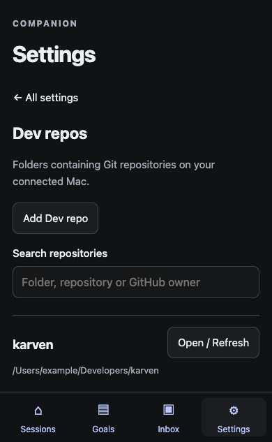
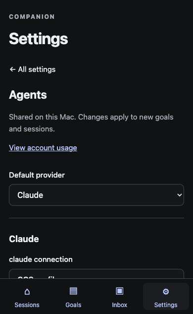
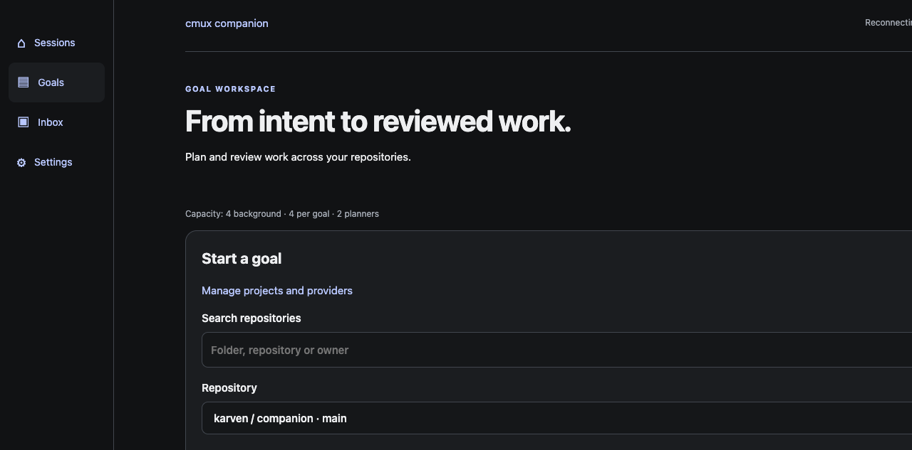

# Settings redesign delivery

Contract: [approved design](superpowers/specs/2026-09-13-settings-dev-repositories-design.md).
Plan: [implementation](superpowers/plans/2026-09-13-settings-dev-repositories.md).
Review: https://github.com/aorfevre/cmux-companion/pull/119
Owner: primary implementing agent. No delegated work.

## Result

Named Dev repos describe parent directories, independently of Git repositories.
Validated collection roots persist in settings schema v2. Bounded discovery is
read-only; only explicitly selected repositories join existing allow-lists.
Matching old repositories retain IDs, enabled flags, checks and goal snapshots.
Removing a collection keeps selected repositories as individual entries.

One categorized Settings screen replaces the split settings experiences. Desktop
uses a category sidebar; mobile uses category drill-down. Provider setup exposes
Direct CLI or CCS profile choices, with executable paths in Advanced. Repository
editors suggest actual npm scripts and retain explicit verification argv. Saving
preserves unrelated concurrent edits; same-field conflicts preserve and compare
the draft. Shared navigation reaches the real Goals board directly, and search
includes named groups and GitHub owners. Update installation remains opt-in/off.

Shared typography, neutral surfaces, focus styles, controls and touch targets
apply to monitoring, goals, settings and ancillary screens. Saved-state controls
no longer obstruct the mobile settings content. Browser URLs remain compatible.

## Boundary evidence

| Boundary | Behavior and verification |
| --- | --- |
| UI | Categorized editors, guarded navigation, saved/draft conflict review; UI tests and browser navigation scenarios. |
| API | Paired/same-origin discovery by saved root ID, scoped revision-checked writes; security and concurrency fixtures. |
| Storage | Atomic schema-v2 migration preserves identity/history; stopped backup restoration returns exactly to v1. |
| Background | Discovery cannot admit work; explicitly selected repositories enter runtime configuration. Group containment is rechecked for manual discovery/admission; existing goals keep snapshots and ownership fencing. |
| External | Git inspection and package.json reads only during configuration. Providers, GitHub publication and updater activation use disposable/fake adapters in browser tests. No installed configuration, Tailscale state, paid agent run or live update changed. |

## Checks

- `npm run verify`: passed (759 backend passes, one platform skip; 129 UI passes;
  lint, both typechecks and production build).
- `npm run test:coverage`: passed; backend line coverage **97.41%**.
- `npm run test:ui:coverage`: passed; UI line coverage **96.00%**.
- Standard Chrome Cypress: **82 passed**; five real-service tests deliberately
  excluded by the standard runner and exercised through their dedicated modes.
- Real settings Cypress: named karven/rekord journey passed, including persistence,
  grouped selection, goal creation with fake providers and disabling new work.
- Real update Cypress: passed independently, including default-off policy, exact
  commit confirmation, queuing/cancellation and explicit automatic installation.
- Visual matrix: 12 main surfaces at 360, 390 and 1440 CSS pixels; no horizontal
  overflow. Includes keyboard focus, cancelled draft navigation, old URLs and
  200% CSS zoom reflow. Screenshots are viewport captures, avoiding stitched
  duplicates of fixed navigation. Native browser zoom and assistive-technology
  testing are separate unverified paths.

Final touch-target/settings/session regression: **25 passed**. Dedicated real
orchestration: **2 passed**, with its read-only scenario excluded in that mode;
`--orchestration --read-only`: **1 passed**, with the two mutating scenarios
excluded. Together the dedicated modes cover all five scenarios omitted by the
standard runner. A production rebuild after the final CSS adjustments passed.
The final cache-containment regression and catalog suite passed **30 tests**;
lint and both typechecks passed again after that backend check was added. The
additional test brings the final backend suite to 760 passes plus one platform skip.

## Interventions and remaining gaps

Initial browser runs exposed an SSR/category hydration mismatch, a click before
hydration, and inspection temporarily blocking an input; these were fixed, then
the affected scenarios passed. Test fixtures were migrated from the former
Settings page and preserved feature assertions. Explicitly associated labels were
flattened to avoid duplicate accessible-name query matches.

A test port was already owned; another port was used. Concurrent generated HTML
coverage output triggered Vite reloads; coverage and Cypress artifacts are now
excluded from its watcher. The read-only runner requires `--read-only` (it overrides the similarly named
environment setting); the correct flag was used for its final verification.
The updater scenario is run in its own disposable
service because a goal created by the settings journey correctly prevents an idle
update. No production guards were bypassed.

The bundled updater still refuses changed data contracts. Installing schema v2
requires the existing explicit migration/backup procedure; rollback to a v1
binary requires restoring its v1 database. No live installation or rollback was
performed. Human usability timing (the three-minute success measure), live
Claude/Codex accounts, real browser push delivery, VoiceOver, native browser zoom
and exhaustive WCAG auditing remain unverified. Automated fixture results are
not evidence for those paths.

## Visual examples

